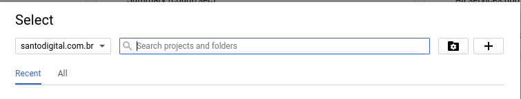
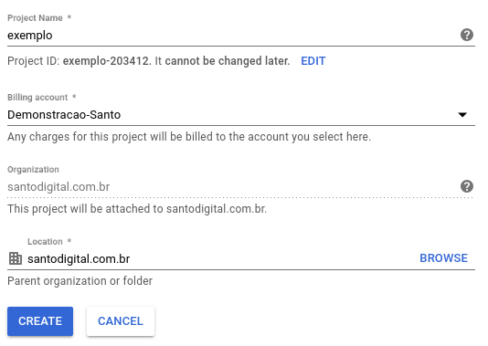

Exemplo de Api PHP utilizando SLIM
---

Esse exemplo visa como podemos desenvolver uma api PHP utilizando Google Cloud App Engine. 
Você vai perceber como é simples fazer o deploy de uma aplicação.

Configurando seu projeto
---

Entre no console do Google Cloud Platform com o link [https://console.cloud.google.com](https://console.cloud.google.com). Nesse endereço será necessário que crie seu projeto ou utilize algum projeto que você já possui.






```
composer install
gcloud app deploy

```


